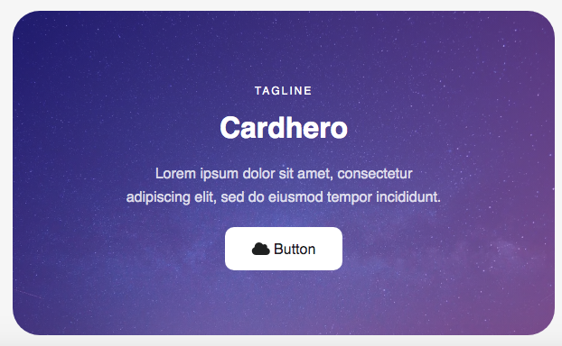

# cardhero



Feature

* Tagline
* Title
* Description
* Button
* Background

HTML

```markup
        <div class="cardhero next">
            <div class="hero" style="background-image: linear-gradient(135deg, rgba(48, 35, 174, .6), rgba(200, 109, 215, .6)), url('https://cdn.pixabay.com/photo/2015/07/02/10/13/sky-828648_960_720.jpg');">
                <div class="tagline">Tagline</div>
                <h2>Cardhero</h2>
                <p>Lorem ipsum dolor sit amet, consectetur adipiscing elit, sed do eiusmod tempor incididunt.</p>
                <a href="#" target="_blank" class="button"><i class="fas fa-cloud"></i> Button</a>
            </div>
        </div>
```

CSS  \( add to your =&gt; css/components.css \)

```css
/* Start cardhero */

.cardhero .hero {
    display: flex;
    height: 340px;
    padding-right: 20%;
    padding-left: 20%;
    padding-top: 20px;
    border-radius: 30px;
    flex-direction: column;
    justify-content: center;
    align-items: center;
    background-size: cover;
    background-repeat: no-repeat;
    background-position: 50% 50%;
    text-align: center;
}

.cardhero .tagline {
    font-size: 12px;
    font-weight: 500;
    letter-spacing: 2px;
    text-transform: uppercase;
    margin-bottom: 10px;
    color: #fff;
    
}

.cardhero h2 {
    font-size: 32px;
    margin-top: 5px;
    margin-bottom: 15px;
    color: #fff;
}

.cardhero p {
    font-size: 16px;
    line-height: 26px;
    margin-top: 5px;
    margin-bottom: 20px;
    color: hsla(0, 0%, 100%, .8);
}

.cardhero a {
    color: #1F2020;
}

.cardhero .button {
    display: inline-block;
    margin-bottom: 10px;
    padding: 14px 30px 6px 30px;
    float: none;
    background: #FFF;
    line-height: 22px;
    border-radius: 10px;
    text-decoration: none;
}

.cardhero .button:hover {
    background: #e7e7e7;
}

/* End cardhero */
```

