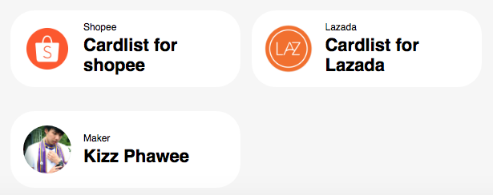

# cardlist



Feature

* Image
* Tagline
* Title

HTML

```markup
        <div class="cardlist">
            <a class="link" href="#" ><div class="avatar" style="background-image:url('https://aromaincense.id/wp-content/uploads/2018/10/shopee-icon-png-5.png');" ></div></a>
            <div class="text">
                <a class="tagline">Shopee</a>
                <a class="title" href="#">Cardlist for shopee</a>
            </div>
        </div> 
```

CSS  \( add to your =&gt; css/components.css \)

```css
/* Start Cardlist */

@media screen and (min-width: 100px) {
    .cardlist {
        width: 330px;
        margin-left: 0;
        margin-right: 0;
        padding: 8px 8px;
    }
}
@media screen and (min-width: 610px) { 
    .cardlist {
        width: 275px ;
        margin-left: 5px;
        margin-right: 5px;
        padding: 8px 6px;
    }
}  
.cardlist {
    background: white;
    border-radius: 30px;
    min-height: 80px;         
    display: inline-flex;
    align-items:center;
    
}    
.cardlist .link {
    text-decoration: none;
    color: inherit;
    cursor: pointer;
    margin-left: 5px;
    margin-right: 5px;
}    
.cardlist .avatar {
    display: block;
    margin-left: 5px;
    margin-right: 0px;
    
    width: 60px;
    height: 60px;
    background-size: cover;
    background-repeat: no-repeat;
    
    background-position: 50% 50%; 
    border-radius: 50%;
    vertical-align: middle;
    display: inline-block;

}        
.cardlist img {
    border: 0;
} 

.cardlist .text {
    margin-left: 10px;
}
.cardlist a {
    display: block;
    font-family: sans-serif;
    text-decoration: none;
    color: black;

}
.cardlist .tagline {
    font-size: 12px;
    padding-bottom: 3px;       
}
.cardlist .title {
    font-size: 22px;
    font-weight: bold;
}

/* End Cardlist */
```

