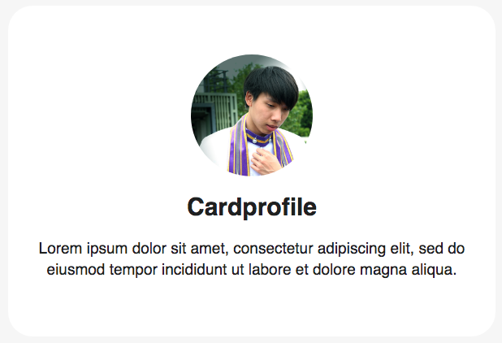

# cardprofile




Feature

* Circle Image
* Title
* Description

HTML

```markup
        <div class="cardprofile next">
            <div class="avatar" style="background-image:url(img/kizzcon3.png);"></div>
            <h2>Cardprofile</h2>
            <p>Lorem ipsum dolor sit amet, consectetur adipiscing elit, sed do eiusmod tempor incididunt ut labore et dolore magna aliqua.</p>
        </div>
```

CSS  \( add to your =&gt; css/components.css \)

```css
/* Start Cardprofile */
    
    .cardprofile {
        padding: 60px 20px;
        background: white;
        border-radius: 30px; 
    }

    .cardprofile .avatar {
        width: 150px;
        height: 150px;
        background-size: cover;
        background-repeat: no-repeat;
        border-radius: 50%;
        
    }
    
    .cardprofile h2 {
        padding: 20px 0 20px 0;
        text-align: center;
        font-size: 30px;
    }
    
    .cardprofile p {
        text-align: center;
        font-size: 19px;
        line-height: 26px;

    }

/* End Cardprofile */
```

