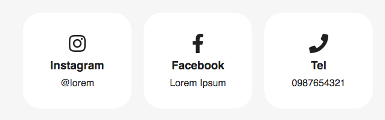

# cardsocial



Feature

1-3 Column

* Icon
* Title
* Description

HTML

```markup
        <div class="cardsocial">
            <div class="row">
                <div class="column">
                    <div class="card">
                        <i class="fab fa-instagram fa-2x"></i>
                        <h3>Instagram</h3>
                        <p>@lorem</p>
                    </div>
                </div>
                <div class="column">
                    <div class="card">
                        <i class="fab fa-facebook-f fa-2x"></i>
                        <h3>Facebook</h3>
                        <p>Lorem Ipsum</p>
                    </div>
                </div>
                <div class="column">
                    <div class="card">
                        <i class="fas fa-phone fa-2x"></i>
                        <h3>Tel</h3>
                        <p>0987654321</p>
                    </div>
                </div>
            </div>
        </div>
```

CSS  \( add to your =&gt; css/components.css \)

```css
/* Style the counter cards */

.cardsocial .card {
    padding: 35px 10px 23px 10px;
    text-align: center;
    background: white;
    border-radius: 30px;
    min-height: 100px; 
    margin-bottom: 30px;
}

.cardsocial h3,i,p {
    margin-bottom: 10px;
}

@media screen and (min-width: 100px) {
    .cardsocial .row {
        margin: auto;
    }
    .cardsocial .column {
        width: 100%;
        display: block;
    }
}

@media screen and (min-width: 610px) { 
    .cardsocial .row {
        margin: auto;
        display: flex;
    }
    .cardsocial .column {
        float: left;
        width: 180px;
        padding: 0 10px;
    
    }
}  

/* End Cardsocial */
```

