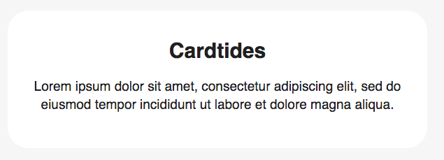

# cardtides



Feature

* Title
* Description


HTML

```markup
        <div class="cardtides next">
            <h2>Cardtides</h2>
            <p>Lorem ipsum dolor sit amet, consectetur adipiscing elit, sed do eiusmod tempor incididunt ut labore et dolore magna aliqua.</p>
        </div>
```

CSS \( add to your =&gt; css/components.css \)

```css
/* Start Cardtides */

    .cardtides {
        padding: 40px 20px;
        background: white;
        border-radius: 30px; 
    }
    
    .cardtides h2 {
        padding: 0 0 20px 0;
        text-align: center;
        font-size: 30px;
    }
    
    .cardtides p {
        text-align: center;
        font-size: 19px;
        line-height: 26px;

    }  

/* End Cardtides */
```

